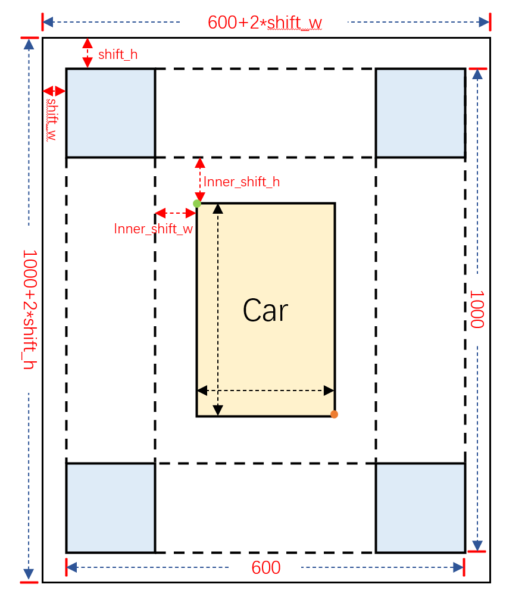
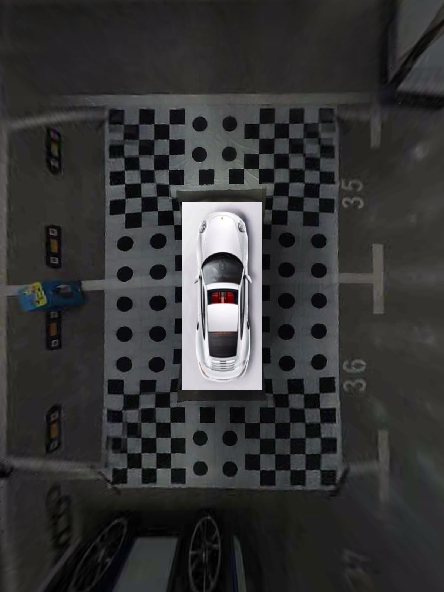

### **鱼眼相机全景环视系统实现**

参考开源项目：
https://github.com/neozhaoliang/surround-view-system-introduction
基础介绍见README

车辆与棋盘格标定布的位置关系如下图所示

实现步骤：
1. **标定四个鱼眼相机的内参**
`python run_calibrate_camera.py `
有命令行参数如下：
- `-i`：指定输入相机的端口号
- `-o`：指定标定结果存放路径
- `-fisheye`：添加此参数即表示该相机为鱼眼相机
- `-no_gst`：添加此参数表示该相机不为CSI相机
程序启动后，手拿棋盘格图像在相机前方拍摄，待相机检测到特征点后，按下键盘c键开始标定，屏幕显示success后即可按q键退出程序
2. **配置投影参数**
修改surrond_view子目录下的`param_setting.py`文件，其中：
- `shift_w,shift_h`：为鱼眼相机向标定布外看的距离，使用默认的300mm即可
- `inn_shift_w,inn_shift_h`：为车辆与标定布之间的横纵向距离，使用卷尺测量即可
- `total_w,total_h`：为总的宽高，标定布宽高加上两倍shift_w或shift_h
- `(xl,yt)`：车辆左上角坐标，需要数棋盘格确定
- `(xr,yb)`：车辆右下角坐标
- `project_shapes`：四个方位的相机投影后的大小，不做修改
- `project_keypoints`：此为下一步选取的投影点在实际标定布中的坐标，需要提前写明确定后再去选取
3. **手动标定获取投影矩阵**
运行脚本`python run_get_projection_maps.py`，命令行可选参数：
- `-camera <camera_name>`：指定是哪个相机
- `-scale <scale_x> <scale_y>`：指定横纵向缩放，范围0~1，1表示不缩放，数字越小画面越大
- `shift <shift_x> <shift_y>`：指定横纵向偏移，数值为正表示画面向左平移，数值为负表示画面向右平移
通过手动指定缩放和平移参数，使得棋盘格尽量在画面中心，且出现较多的棋盘格。接着收订选取标定点，这里选取的标定点要和上面指定的各相机`project_keypoints`对应，选取完成后查看投影变换结果，若无问题按下enter键保存至对应相机的.yaml文件中。
4. **环视图拼接**
运行脚本`python run_get_weight_matrices.py`，即可查看拼接效果。

